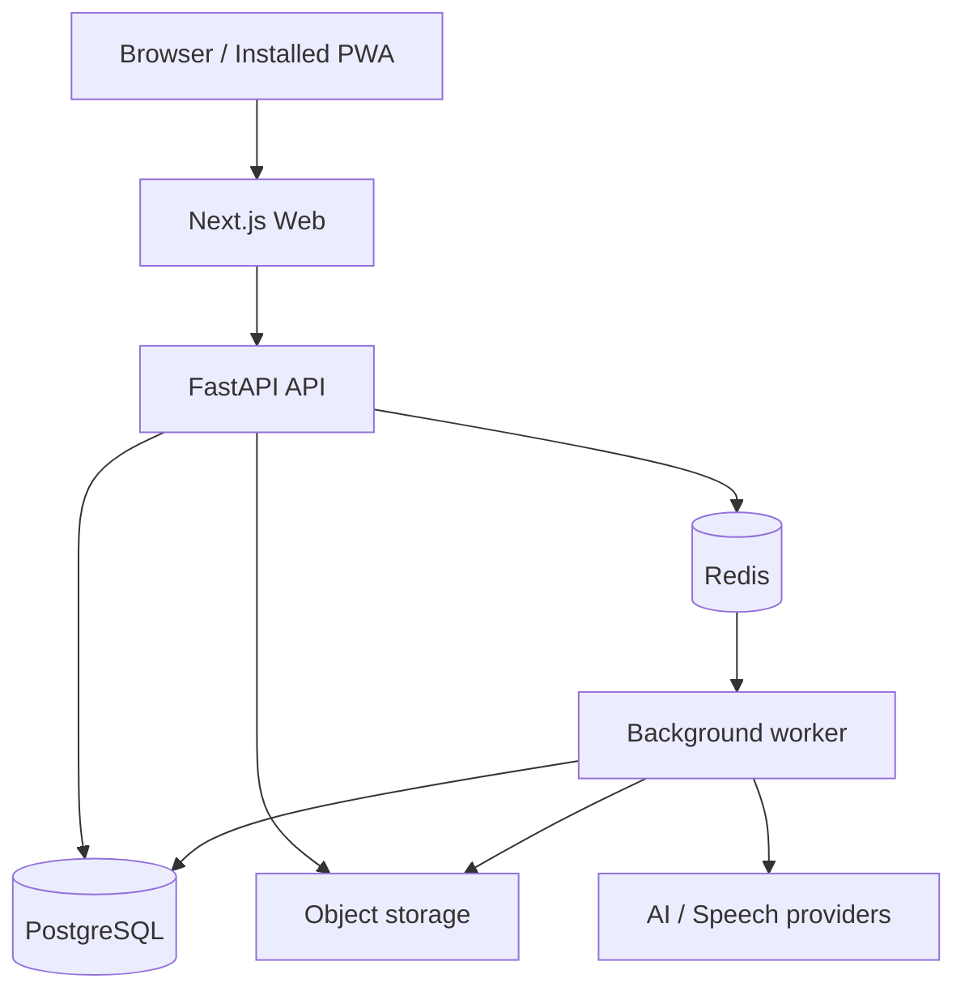

# System architecture

**Status:** Accepted baseline  
**Style:** Modular monolith with process separation  
**Deployment target:** Railway

## 1. Architectural goals

The architecture must optimize for:

1. fast iteration for a small team;
2. content extensibility without application deployment;
3. reliable progress and review state;
4. isolation of slow or unreliable AI and speech work;
5. replaceable infrastructure providers;
6. an evolutionary path to multiple users and tracks;
7. understandable local development and operations.

It must avoid two opposite failures: a single tangled application where every feature depends on every table, and premature distributed microservices that increase operational cost before scale exists.

## 2. Runtime topology



### Web process
Owns presentation, routing, local interaction state, PWA assets, accessibility, and typed API client. It does not implement domain rules.

### API process
Authenticates requests, coordinates use cases, commits authoritative state, creates jobs, and exposes versioned contracts. It returns promptly for long operations.

### Worker process
Consumes idempotent jobs for transcription, speech analysis, AI evaluation, content suggestions, media transformation, report generation, and notification preparation.

### PostgreSQL
Authoritative store for identity, content, curriculum, attempts, progress, job metadata, provider results, and audit records.

### Redis
Queue transport, short-lived locks, rate limiting, and optional ephemeral cache. Redis is never the only owner of valuable learning state.

### Object storage
Audio and future media. Database rows retain ownership, status, checksums, retention, and object keys.

## 3. Logical modules

- **Identity & Access**
- **Learner Profile**
- **Content Catalog**
- **Curriculum & Releases**
- **Learning Sessions**
- **Exercise Engine**
- **Attempts & Evaluation**
- **Mastery & Review**
- **Speaking**
- **Interview**
- **Gamification**
- **Analytics**
- **Administration**
- **Provider Gateway**
- **Platform Operations**

Each module owns its domain types, application services, repository interfaces, events, and tests. Cross-module table access is forbidden in application logic; data exchange uses public services, queries, contracts, or recorded domain events.

## 4. Dependency rule

Recommended backend layers:

```text
HTTP / jobs / CLI adapters
          ↓
Application use cases
          ↓
Domain model and policies
          ↓
Ports (repository/provider interfaces)
          ↓
PostgreSQL / Redis / provider adapters
```

The domain layer imports no framework, database client, queue client, or provider SDK.

The frontend follows a similar separation:

```text
Routes and layouts
      ↓
Feature modules
      ↓
UI components + application state
      ↓
Typed API client
```

UI components do not query databases or reproduce backend evaluation rules.

## 5. Modular monolith boundaries

“Modular monolith” means source and data may share a deployment and database, but module ownership remains explicit.

Rules:

- schemas may share one PostgreSQL cluster;
- migrations declare owning module;
- repositories access only owned tables;
- foreign keys across modules are allowed selectively for integrity;
- application logic does not join across foreign module tables ad hoc;
- cross-module read models may be purpose-built;
- domain events describe meaningful changes;
- internal APIs are typed and testable;
- extraction to another service remains possible without changing domain semantics.

## 6. Primary data flows

### Complete deterministic exercise
1. Web requests next activity.
2. API resolves enrollment, release, and due review priorities.
3. Exercise Engine materializes an exercise instance from a published blueprint.
4. Web captures answer and client timing metadata.
5. API stores attempt before evaluation side effects.
6. Deterministic evaluator records evaluation.
7. Mastery policy updates projection and review schedule in the same transaction when possible.
8. API returns feedback and next-action summary.

### Complete speaking exercise
1. API creates media upload record and signed upload authorization.
2. Browser uploads audio directly to object storage.
3. Browser confirms checksum/size.
4. API finalizes media and enqueues processing job.
5. Worker transcribes and stores immutable provider result.
6. Worker runs language/interview evaluation.
7. Application creates evaluation record and updates mastery.
8. Web receives status by polling initially; future real-time delivery is optional.

### Publish curriculum
1. Editor changes mutable draft entities.
2. Validation resolves relationships, required translations, and evaluator compatibility.
3. Preview materializes representative activities.
4. Publish creates immutable content versions and course release manifest.
5. Existing enrollments remain pinned unless migration policy says otherwise.
6. Audit event records actor, release, diff summary, and validation result.

## 7. Consistency and transactions

Strong consistency is required for:

- attempt persistence;
- deterministic evaluation;
- mastery/review update tied to an attempt;
- publishing a coherent release;
- issuing or consuming one-time refresh tokens;
- object metadata state transitions.

Eventual consistency is acceptable for:

- AI analysis;
- speech processing;
- dashboards derived from events;
- badge awards;
- aggregate analytics;
- search indexes.

Use an outbox pattern when a committed database change must reliably enqueue or publish follow-up work.

## 8. API design

- Version public HTTP routes, initially `/api/v1`.
- Use generated OpenAPI contracts.
- Use stable machine error codes plus localized messages.
- Support idempotency keys for attempt submission, uploads, and expensive AI requests.
- Use cursor pagination for large catalogs and event histories.
- Return resource versions/ETags where concurrent editing matters.
- Do not expose persistence models directly.
- Include correlation IDs in responses and logs.

Example error envelope:

```json
{
  "error": {
    "code": "CONTENT_VERSION_CONFLICT",
    "message": "The draft changed after it was opened.",
    "correlation_id": "..."
  }
}
```

## 9. Background-job contract

Every job includes:

- job type and schema version;
- stable idempotency key;
- aggregate/resource identifiers;
- correlation and causation IDs;
- attempt number;
- creation time and deadline;
- provider preference/fallback policy;
- non-secret input reference.

Workers must:

- safely retry transient errors;
- distinguish permanent validation failures;
- never duplicate billable work when a previous result can be recovered;
- persist failure classification;
- move exhausted jobs to a reviewable dead-letter state;
- emit duration and cost metrics.

## 10. Provider abstraction

Ports include:

- `AITextProvider`
- `SpeechToTextProvider`
- `TextToSpeechProvider`
- `PronunciationAssessmentProvider`
- `ObjectStorageProvider`
- `EmailProvider` (future)

Provider-neutral requests use product domain concepts. Raw provider payloads may be archived for debugging within retention limits, but do not leak into domain types.

## 11. Caching strategy

Cache only after measurement.

Safe early candidates:

- published immutable content versions;
- course release manifests;
- public configuration;
- short-lived dashboard projections.

Never depend on cache for:

- attempt durability;
- review schedule ownership;
- permissions;
- publish correctness.

Every cache entry has a documented key, owner, TTL, and invalidation method.

## 12. Failure behavior

- Provider unavailable: preserve attempt, show processing state, retry, permit text learning.
- Redis unavailable: synchronous core remains usable where safe; job creation persists to outbox.
- Worker unavailable: queued work accumulates visibly; no completed attempt is lost.
- Object storage unavailable: disable new recording gracefully; do not affect text exercises.
- Database unavailable: fail closed; never pretend progress was saved.
- Partial publish: transaction rolls back; no release becomes visible.
- Frontend deployment mismatch: API version compatibility window prevents immediate breakage.

## 13. Evolution triggers

Extract a module into a service only if at least one is demonstrated:

- materially different scaling pattern;
- security or compliance isolation;
- deployment cadence conflict;
- provider-heavy worker resource isolation;
- persistent ownership/team boundary;
- reliability requirements impossible in shared process.

Likely first extraction candidates are media/AI processing, not content or progress.

## 14. Architecture decision records

Use `docs/adr/NNNN-title.md` for decisions with long-term cost. Every ADR documents context, decision, alternatives, consequences, migration, and review triggers.

Initial ADR candidates:

- modular monolith and process separation;
- Railway-first provider-neutral deployment;
- immutable published content versions;
- append-only attempts with derived mastery;
- PostgreSQL source of truth;
- provider gateway design.
