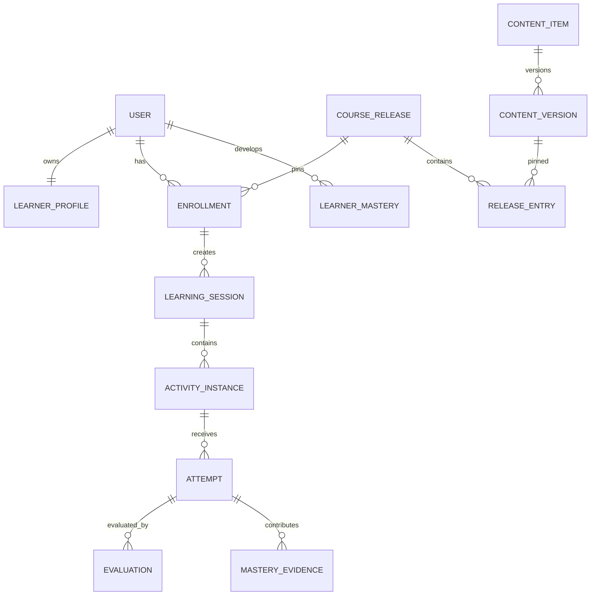

# Domain and data model

**Status:** Accepted conceptual baseline  
**Database:** PostgreSQL  
**Rule:** Logical IDs express identity; immutable versions express published meaning.

## 1. Modeling goals

The data model must support reusable multilingual content, mutable drafts and immutable published versions, multiple course releases, generated activities, append-only attempts, explainable mastery, asynchronous speech analysis, future multi-user operation, and safe archival.

The schema must not assume that one verb belongs to exactly one day, one lesson has one exercise type, or progress equals page completion.

## 2. Identity and versioning

Versioned authoring entities use two levels:

- **Logical entity:** stable identity across edits, such as the verb “entwickeln.”
- **Entity version:** immutable published meaning shown to learners.

Drafts may change. Published versions never change in place. Corrections create a new version. Historical attempts continue referencing the exact version shown.

Logical entity fields include UUID, status, creator, creation time, and archival metadata. Version fields include entity ID, version number, lifecycle, schema version, checksum, creator, creation time, and publication metadata. Entity/version number is unique.

## 3. Major aggregates

### Identity
`users`, `credentials`, `sessions`, `refresh_tokens`, `roles`, and `user_roles`.

Even with one private user, rows are scoped by `user_id`; no global current-user assumption enters domain data.

### Learner
`learner_profiles`, `learner_goals`, `learner_claims`, `baseline_assessments`, and `preferences`.

Claims are truthful professional facts available for personalization. They require origin and verification status so AI cannot silently convert suggestions into biography.

### Content
`content_items`, `content_versions`, `content_localizations`, type-specific details, `examples`, `content_relationships`, `tags`, `content_tags`, and `media_assets`.

Types include verb, vocabulary, phrase, grammar pattern, interview question, technical concept, scenario, and rubric. Type-specific tables preserve validation and queryability. JSONB is for bounded extensions and provider metadata, not stable relational concepts.

### Curriculum
`courses`, `course_versions`, `tracks`, `modules`, `lessons`, `learning_objectives`, `lesson_objectives`, `activity_blueprints`, `prerequisite_edges`, `course_releases`, `release_manifest_entries`, and `enrollments`.

A release manifest pins exact versions of structure, content, evaluator configuration, and rubrics.

### Learning runtime
`learning_sessions`, `activity_instances`, `attempts`, `attempt_answers`, `evaluations`, `evaluation_dimensions`, `feedback_items`, and `hint_usage`.

An instance records what was shown. An attempt records what the learner did. An evaluation records how it was judged. This permits re-evaluation without rewriting history.

### Mastery and review
`learning_targets`, `learner_mastery`, `mastery_evidence`, `review_schedules`, `review_queue_entries`, and `mastery_events`.

A target is more precise than a content item: recognize meaning, produce first-person present, construct Perfekt, use in a project explanation, or understand a linked question.

### Speaking and interviews
`media_uploads`, `transcription_jobs`, `transcripts`, `speech_assessments`, `interview_blueprints`, `interview_sessions`, `interview_turns`, `interview_reports`, and `readiness_snapshots`.

### Operations
`outbox_events`, `background_jobs`, `provider_invocations`, `audit_events`, `feature_configuration`, and `schema_migrations`.

## 4. Core relationships

## 5. Content details

Common version fields include canonical language, display name, definition, CEFR range, difficulty, register, editorial state, source/license, and schema revision.

Verb details include infinitive, normalized lemma, Perfekt auxiliary, Partizip II, selected Präteritum, separable prefix, reflexive behavior, regularity, governed cases/prepositions, conjugation overrides, and usage notes.

Examples remain separate so they can be localized, tagged, ranked, versioned, related to several items, and reused.

## 6. Attempt invariants

An attempt is append-only after submission except operational metadata that does not alter meaning. It records learner, enrollment, activity instance, objective, content/evaluator versions, prompt snapshot/checksum, raw and normalized answer, timestamps, duration, hints, input mode, idempotency key, and evaluation status.

A retry creates another attempt and never overwrites the previous answer.

## 7. Evaluation model

An attempt may have deterministic, AI-assisted, human override, or later benchmark evaluations. Each evaluation records evaluator and rubric versions, status, score, dimensions, confidence, evidence, feedback, time, and supersession. Mastery policy identifies authoritative evidence.

## 8. Mastery projection

`learner_mastery` is derived for queries. It contains target, state, stability/difficulty, confidence, success streak, lapses, last attempt/success, next review, and source event sequence. It must be rebuildable from events.

## 9. Course release pinning

Enrollment references one release. The manifest pins lesson, content, activity, evaluator, and rubric versions. Existing learners are not silently moved. Options are staying pinned, opting in, controlled migration with compatibility report, or urgent isolated correction.

## 10. Deletion and retention

Unused drafts may be deleted with permission. Published referenced content is archived. Voice media may expire before transcripts/scores according to consent. Provider payloads have short retention. Account deletion explicitly handles export, token revocation, media cleanup, and anonymization/deletion.

## 11. Constraints

Database constraints enforce unique version numbers, required publication metadata, nonnegative attempts/durations, valid locales, ownership foreign keys, object/checksum uniqueness, allowed relationships, and duplicate curriculum prevention.

## 12. Migration discipline

All schema changes use committed migrations. Production migrations are forward-only; correction is a new migration. Destructive changes follow expand/migrate/contract. Large backfills are resumable jobs. Deployments remain compatible during transitions. Backup and restore are tested before high-risk migrations.
