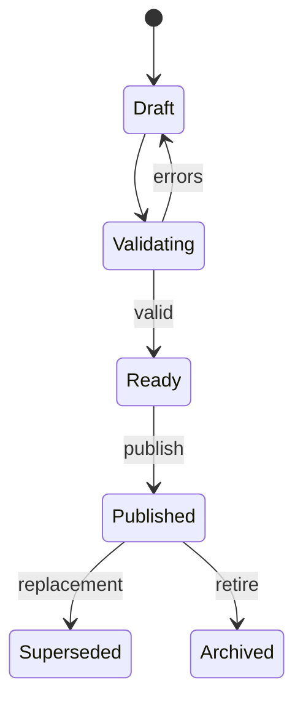

# Content architecture and authoring

**Status:** Accepted baseline

## 1. Purpose

Adding a verb, question, example, grammar rule, or scenario must normally require authoring and publishing data—not editing code. Content still needs typed validation, relationships, versioning, provenance, preview, and safe release behavior.

## 2. Taxonomy

Initial types are Verb, Vocabulary, Phrase, Grammar Pattern, Example, Interview Question, Technical Concept, Scenario, Recovery Phrase, Rubric, and Media Asset.

The taxonomy uses a controlled registry. Adding an item of an existing type requires no code. A genuinely new structural type requires schema and rendering support.

## 3. Separation

- **Catalog:** what an item means linguistically.
- **Relationships:** how items connect.
- **Curriculum:** when and why learners encounter it.
- **Exercise blueprint:** how an objective becomes an interaction.
- **Learner state:** how well one learner performs a target.

No layer may hide another layer’s responsibility inside opaque JSON.

## 4. Verb contract

A verb supports lemma, display infinitive, translations, present conjugation with overrides, Perfekt auxiliary and participle, selected Präteritum, separability, reflexivity, governed case/preposition, regularity, CEFR, register, frequency, pronunciation, collocations, mistakes, examples, questions, and grammar relationships.

Example import:

```json
{
  "external_id": "verb.entwickeln",
  "type": "verb",
  "canonical_language": "de",
  "lemma": "entwickeln",
  "translations": {"fa": ["توسعه دادن"], "en": ["to develop"]},
  "grammar": {
    "perfect_auxiliary": "haben",
    "participle_ii": "entwickelt",
    "separable": false,
    "reflexive": false,
    "conjugation_overrides": {}
  },
  "classification": {
    "cefr": "A2",
    "domains": ["software-development", "interview"],
    "register": "neutral"
  },
  "examples": [{
    "external_id": "example.entwickeln.api.perfect",
    "de": "Ich habe eine REST-API entwickelt.",
    "fa": "من یک REST API توسعه داده‌ام.",
    "skills": ["past-experience", "technical-speaking"]
  }]
}
```

External IDs make imports idempotent; UUIDs remain internal.

## 5. Lifecycle



Draft is editable. Publishing creates an immutable version and an audit record.

## 6. Validation

- Structural: fields, types, locales, IDs, lengths.
- Linguistic: auxiliary/participle, prefixes, reflexive structure, placeholders.
- Relationship: referenced items, allowed type pairs, cycle policy.
- Pedagogical: examples, ambiguity, difficulty, exercise compatibility.
- Release: all versions, rubrics, evaluators, and media ready.

Results use machine codes and human-readable paths.

## 7. Import pipeline

```text
Upload → Parse → Normalize → Validate → Resolve references
       → Diff → Dry-run report → Approve → Draft import → Preview → Publish
```

CSV handles simple tables; JSON handles nested relationships; Excel enters through a controlled importer. Import upserts by external ID, never publishes raw uploads, provides row errors, stores source/checksum, and forbids partial publish.

## 8. Exercise safety

Content supplies facts and variants. Generators reject ambiguity. A translation with multiple valid answers cannot use exact matching without explicit accepted variants. Free production requires a rubric or semantic evaluator.

Preview shows prompt, accepted answers, normalization, hints, feedback, targets, difficulty, and accessibility behavior.

## 9. Localization

Use localization records, not fixed `name_de/name_fa` columns. Store locale, field, value, state, source, version, and direction when required.

Distinguish canonical language, learning language, explanation language, interface language, and locale. German-to-Persian is configuration, not a schema assumption.

## 10. Relationships

Relations include source, target, type, direction, weight, notes, validity, and provenance. Initial types include `example_of`, `prerequisite_of`, `synonym_of`, `contrasts_with`, `uses_grammar`, `answer_supports_question`, `common_mistake_for`, `domain_related`, `simpler_than`, and `follow_up_to`.

The relation registry defines symmetry, allowed type pairs, and cycles.

## 11. AI-assisted authoring

AI may propose conjugations, translations, examples, distractors, tags, questions, difficulty, and mistakes. Every proposal enters draft with provider/model/prompt provenance. Human approval is required initially.

## 12. Published edits

Corrections create new versions and classify impact: cosmetic, clarification, answer-affecting, semantic, or safety/privacy. Release policy decides pinning, overlay, or migration.

## 13. Admin experience

Minimum screens cover catalog search, type-aware editor, translations, relationships, preview, validation, version diff, curriculum usage, imports, releases, and archive/restore.

Adding one verb should take minutes and automatically expose compatible exercise previews without source changes.

## 14. Quality gate

Before publish, content must be linguistically correct, natural in interviews, truthful when personalized, difficulty-appropriate, clearly translated, sufficiently exemplified, unambiguous, correctly related, sourced/licensed when needed, and accessible on mobile.
