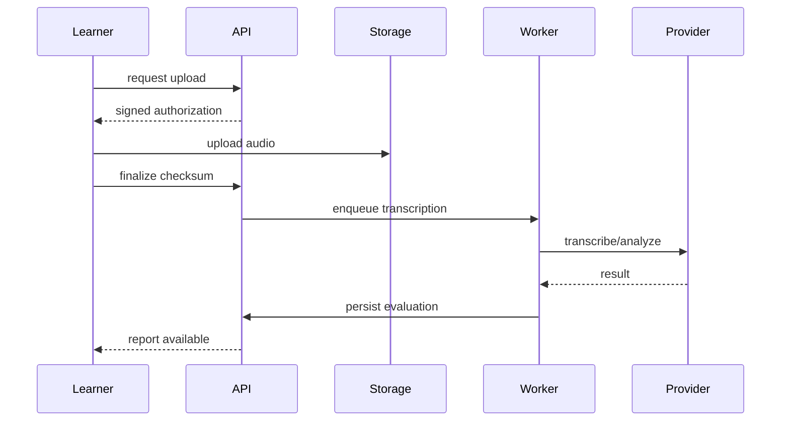

# AI, speech, and mock interviews

**Status:** Accepted baseline

## 1. Role of AI

AI improves open-ended practice, personalization, and feedback. It is not the canonical source of language content, user biography, progress history, or deterministic correctness.

Core text lessons remain usable when AI is unavailable.

## 2. Provider-neutral ports

- `AITextProvider`
- `SpeechToTextProvider`
- `TextToSpeechProvider`
- `PronunciationAssessmentProvider`
- `EmbeddingProvider` only if later justified

Domain requests contain product concepts rather than provider SDK objects. Adapters translate requests and normalize results.

## 3. Invocation record

Every call records purpose, provider, model, prompt/template version, request checksum, correlation ID, timing, tokens/units, estimated cost, result status, safety status, retry chain, and retained output reference.

Secrets and unnecessary raw personal data never enter logs.

## 4. Speech workflow

The original attempt is saved before analysis. Upload, transcription, and assessment each have explicit states and retry rules.

## 5. Transcript handling

Store immutable raw provider transcript and a learner-corrected transcript separately. Corrections do not rewrite provider evidence. Evaluation indicates which transcript it used.

Language auto-detection is constrained to expected languages where possible. German technical English terms remain acceptable when contextually natural.

## 6. Feedback dimensions

- question relevance;
- truthfulness/claim consistency;
- answer structure;
- grammar;
- vocabulary range and appropriateness;
- comprehensibility;
- fluency indicators;
- pronunciation only where evidence is technically credible;
- duration and concision;
- next best correction.

Feedback prioritizes a few high-value actions. It must not punish accent merely for differing from a native accent if understandable.

## 7. Interview modes

### Guided
Shows intent, vocabulary, structure, and optional model.

### Practice
Question and time target; hints on request.

### Realistic
Question only, timed preparation, independent answer, contextual follow-ups.

## 8. Interview blueprint

A blueprint specifies categories, question pool, required/optional coverage, difficulty, duration, follow-up depth, language level, support mode, rubric weights, weak-area policy, and termination rules.

A session materializes a stable plan but may select follow-ups based on answers.

## 9. Follow-up safety

Follow-ups may use verified learner claims and current transcript. They must not introduce invented experience. Generation is constrained to allowed taxonomy and returns structured output validated by the application.

Fallback is a deterministic curated follow-up pool. Provider failure never corrupts the session.

## 10. Prompt management

Prompts are versioned assets with schema, purpose, model constraints, examples, output JSON schema, safety rules, and benchmark cases. Prompt changes are reviewed and benchmarked like code.

Never concatenate arbitrary learner text into a privileged instruction boundary without delimiting and treating it as untrusted data.

## 11. Structured outputs

AI evaluations return schema-validated fields: overall summary, dimensions, cited transcript spans, corrections, improved example, confidence, and safety flags.

Malformed output is rejected/retried; it never enters mastery directly.

## 12. Truthfulness

Learner claims have verified, user-entered, imported-unverified, and AI-proposed states. AI may only state personal facts permitted by the selected policy. A natural rewrite must preserve meaning and measurements.

## 13. Cost and latency

Use deterministic evaluation first. Cache only safe identical requests. Long calls run asynchronously. Configure per-feature model budgets, timeouts, maximum retries, and fallback. Dashboard exposes daily/monthly spend and provider errors.

## 14. Evaluation calibration

Maintain benchmark answers across quality levels and domains. Compare model versions for score agreement, correction validity, bias, verbosity, and cost. Changes that shift readiness scores require versioning and recalculation policy.

## 15. Data retention

Audio retention is configurable and consent-based. Raw provider responses are short-lived unless needed for an active dispute/debug case. Derived feedback may remain after audio deletion. Deletion propagates to storage and supported provider-side resources.

## 16. Future real-time conversation

Do not make real-time voice a first-release dependency. When added, it should use a new streaming adapter and session protocol while preserving interview turns, transcripts, evaluations, and blueprints.
